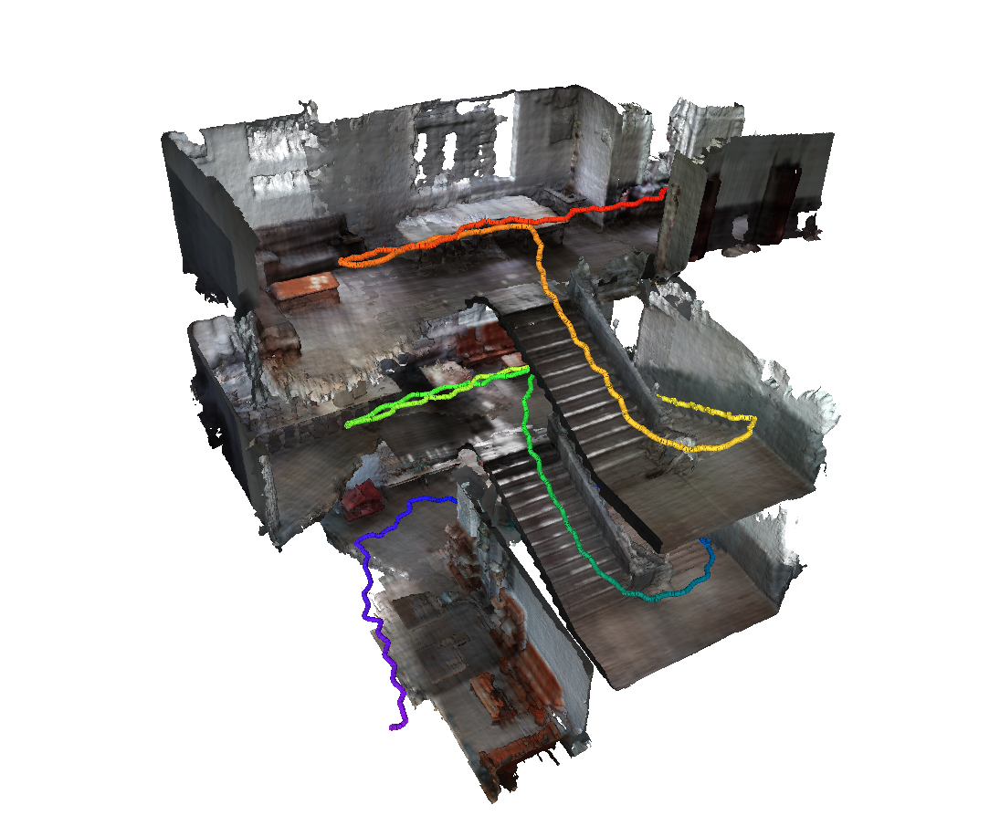

# MIPSFusion
This project is based on our SIGGRAPH Asia 2023 paper, [MIPS-Fusion: Multi-Implicit-Submaps for Scalable and Robust Online Neural RGB-D Reconstruction](https://arxiv.org/pdf/2308.08741.pdf)


## Introduction
MIPSFusion is a neural RGB-D SLAM method based on multi-implicit submap representation, which enables scalable online tracking and mapping for large indoor scenes. Based on divide-and-conquer mapping scheme, each submap is assigned to learn a sub-area of the scene, as shown by the colored bounding box, and a new submap will be created when scanning a new area. This incremental strategy ensures our method has the potential to reconstruct large scenes. Besides, our method can handle fast camera motion.


## Installation
We recommend to creat an annacoda environment from [environment.yaml](environment.yaml)
```
conda env create -f environment.yaml
conda activate MIPSFusion
```
If [pypose](https://github.com/pypose/pypose) or [tiny-cuda-nn](https://github.com/NVlabs/tiny-cuda-nn) is not installed successfully, please try to follow their official installing instructions.

Build other external dependencies
```
cd external/NumpyMarchingCubes
python setup.py install
```

## Run
```
python main.py --config {config_file}
```
For example:
```
python main.py --config configs/FastCaMo-synth/apartment_2.yaml
```
Beforing running, please make sure that `data/datadir` in `{config_file}`(the directory storing the data of this sequence) is set correctly.

The result will be saved to `{result_path}=output/{dataset_name}/{sequence_name}/0` by default. For example: `output/FastCaMo-synth/apartment_2/0`.

## Visualization
To get reconstructd triangle mesh of the scene, an extra step (joint marching cubes) should be taken. You can run
```
python vis/render_mesh.py --config {config_file} --seq_result {result_path} --ckpt {ckpt_id}
```
Here `ckpt_id` is the ID corresponding to a selected checkpoint (checkpoints are periodically saved while the coding is running), such as `100`, `500`, `final`. You can choose to either rendrer the final mesh or mesh reconstructed until `100-th` or `500-th` frame.

For example:
```
python vis/render_mesh.py --config configs/FastCaMo-synth/apartment_2.yaml --seq_result output/FastCaMo-synth/apartment_2/0 --ckpt final
```

## Acknowledgement
Some codes are modified from [Neural RGB-D Surface Reconstruction](https://dazinovic.github.io/neural-rgbd-surface-reconstruction/), [NICE-SLAM](https://github.com/cvg/nice-slam), [Co-SLAM](https://github.com/HengyiWang/Co-SLAM/tree/main), [pypose](https://github.com/pypose/pypose), and [tiny-cuda-nn](https://github.com/NVlabs/tiny-cuda-nn). Thanks to all of the above.

## Citation
If you find our code or paper useful, please cite
```
@article{tang2023mips,
  title={MIPS-Fusion: Multi-Implicit-Submaps for Scalable and Robust Online Neural RGB-D Reconstruction},
  author={Tang, Yijie and Zhang, Jiazhao and Yu, Zhinan and Wang, He and Xu, Kai},
  journal={arXiv preprint arXiv:2308.08741},
  year={2023}
}
```
